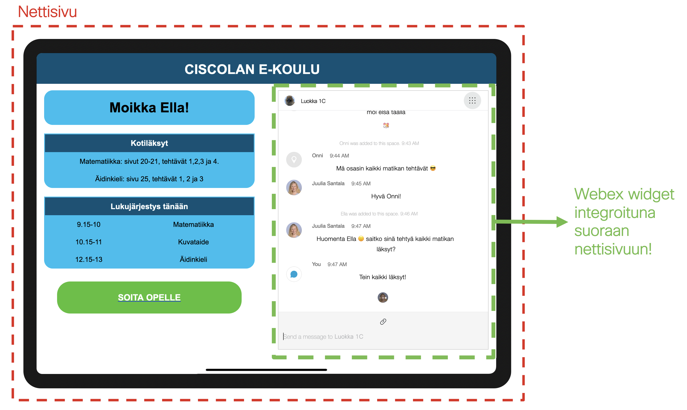
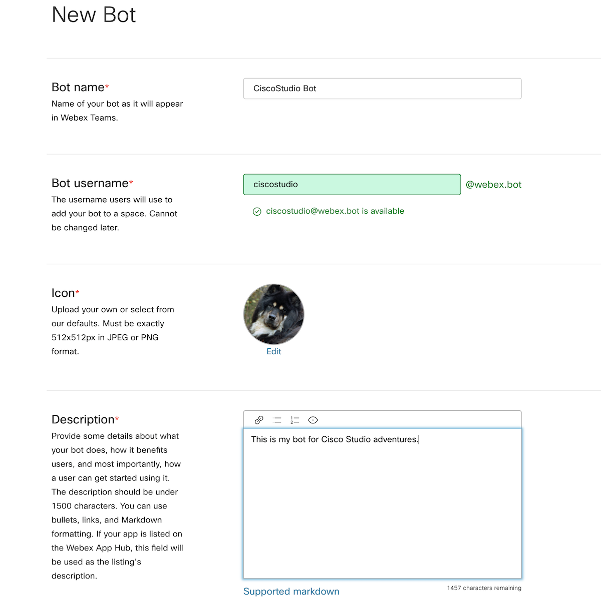

# Cisco Studio - Ellan päivä

Puheessa perheen pienin henkilö, 7-vuotias Ella, käytti Ciscolan alakoulun etäkoulukäyttöliittymää. Tämän avulla hänellä oli Webexin chat ja puhelut helposti käytettävissä ilman että hänen oli tarvetta asennella erillisiä ohjelmia tai hyppiä käyttöliittymästä toiseen.

---

## Mistä elementeistä Ciscolan alakoulun etäkoululiittymä koostuu?



Kovin paljon helpompaa ei voi olla tsätin lisääminen sovellukseen kuin mitä Webexin käyttöönotto on. Käytännössä mitä Ellan etäkoululiittymässä näemme, on verkkosivu, johon olemme vain upottaneet Webexin osaksi muuta kokonaisuutta. Tämä mahdollistaa sen, että voimme käyttää Webexiä samassa paikassa kuin missä meidän muukin sisältö on. Vaikka esimerkki on koulumaailmasta, tämä on mielenkiintoinen käyttötapaus vaikka yrityksen intraan tai lääkärin etävastaanotolle. Webexin käyttä tällä tavalla ei vaadi käyttäjältä minkään sovelluksen lataamista, vaan toimii suoraan verkkoselaimessa ilman ongelmia. Käyttäjällä ei myöskään tarvitse olla Webex tunnuksia, vaan voimme luoda hänelle Guest Issuer -toiminnallisuuden kautta vieras-tunnukset.

Myös Matti hyödyntää sovelluksessaan Webexin rajapintoja. Mikäli haluat oppia lisää itse REST rajapinnosita joita Webex tarjoaa, klikkaile itsesi Matin sivulle lukemaan tästä aiheesta lisää. Ellan kanssa keskitymme itse Widgetiin.

## Miten Webexin integroiminen käyttöliittymään oikein toimii?

Webex on hyvin helppoa integroida nettisivulle, koska siitä on tarjolla helposti käytettävä Widget. Tämän lisäksi Webexillä on SDK:ta, jotka mahdollistavat suuremman kustomoinnin ja Webexin sisällyttämisen esimerkiksi Apple iOS sovellukseen Swift-kielellä.
- [Helppo "avaimet käteen"-Webex widget](https://developer.webex.com/docs/widgets) -> tämä on käytössä Ciscolan alakoulun prototyypissä
- [developer.webex.com](https://developer.webex.com) -> Documentation alta löydät vasemmalla olevasta valikosta dokumentaatiota erilaisille SDK:lle: iOS, Android, Browser, Node.js ja Java. Nämä mahdollistavat paljon kustomointia, mutta vaativat enemmän osaamista käyttöönotossa.
- Kurkkaa esimerkiksi [tämä Swift koodi](https://github.com/webex/webex-ios-sdk-example), jolla demonstroidaan SDK:n käyttöä iOS sovelluksessa

## Kokeile Ciscolan alakoulun prototyyppiä

Lataa [Ciscolan alakoulun prototyyppi](./Ciscolan_alakoulun_koodi), joka demonstroi useaa toiminnallisuutta:
1. Vieraskäyttäjän luominen
2. Vieraskäyttäjän lisääminen huoneeseen botin toimesta
3. Webex widgetin integroiminen nettisivuun

Jotta koodi toimisi, sinun tarvitsee tehdä pari alkuvalmistelua:
1. Jos et ole vielä luonut bottia, luo sellainen! Ota token talteen.
2. Luo huone, johon lisäät Botin. Tarkista huoneen ID rajapintakutsulla (get rooms, kannattaa laittaa sortBy arvoksi "last activity" jotta uusi huoneesi on ensimmäisten joukossa)
3. Luo Guest Issuer ([developer.webex.com](https://developer.webex.com) -> Documentation -> Guest Issuer -> Create a Gues Issuer). Guest issuer on se tekijä, jonka tarvitsemme voidaksemme luoda vieraskäyttäjän. Yhdellä guest issuerilla voimme luoda monta vierasta, joten riittää että luot niitä yhden. Lue lisää aiheesta [Guest Issuerin dokumentaatiosta](https://developer.webex.com/docs/guest-issuer). Dokumentaation lukeminen auttaa sinua myös ymmärtämään koodin logiikan.
4. Lisää credentials tiedostoon:
  - Gues Issuer ID
  - Guest Issuer secret
  - Botin token
  - Room ID
  - Opettajan sähköposti eli oma sähköpostiosoitteesi jolla olet kirjautunut Webexiin.
5. Lataa requirements.txt tiedostossa eritellyt Python moduulit
6. Aja ohjelma komentoriviltä seuraavasti:
```
export FLASK_APP=main.py
flask run -p
```
7. Näet komentorivillä localhost portin jossa sovellus pyörii: navigoi sinne selaimellasi ja testaile, miten sovellus toimii :)

## Botin luominen
Botin luominen on yksinkertaista. Löydät oikean paikan kun menet [developer.webex.com](https://developer.webex.com) -> Documentation -> Bots -> Create a Bot. Täytä haluamasi tiedot ja valitse "Add Bot". Huolehdi että otat Botin tokenin talteen, se näytetään sinulle vain kerran. Voit kuitenkin myös generoida uuden tokenin myöhemmin, mikäli unohdat tai hukkaat vanhan tokenin.



Jotta voit käyttää Botia viestien lähettämiseen ja lukemiseen, tarvitsee botin olla osallisena siinä huoneessa tai keskustelussa jota se kuuntelee. Muista siis lisätä uusi Bottisi siihen huoneeseen jossa haluat toimia sen kanssa, tai aloittaa 1:1 keskustelu sen kanssa. Bot näkee vain ne viestit jotka ovat suunnattu sille.

**[Lue lisää Botin toiminnasta täältä](https://developer.webex.com/docs/bots)**
