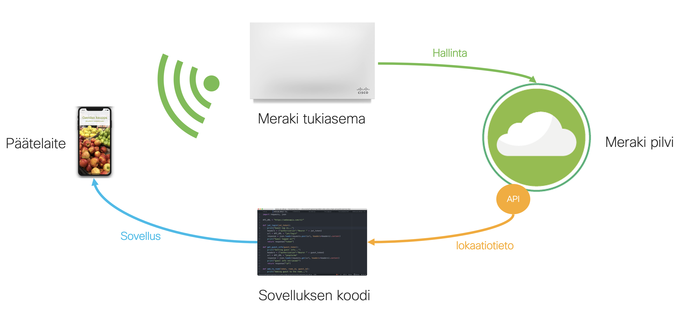

# Cisco Studio - Ciscolan kauppa

Puheen lopussa Ella ja Minna käyvät Ciscolan kaupassa, joka tarjoaa monsterin metsästyspelin kaupassa vieraileville! Tämä peli mahdollistaa alennuskuponkien keräämisen kaupassa, ja antaa viihdettä lapselle samalla kuin vanhemmat voivat keskittyä ostosten tekoon. Kyseinen peli hyödynsi lokaatioanalytiikkaa, jota pystymme saamaan Merakin tukiasemista.

---

## Mistä elementeistä Ciscolan kaupan fiktiivinen monsteripeli koostuu?

