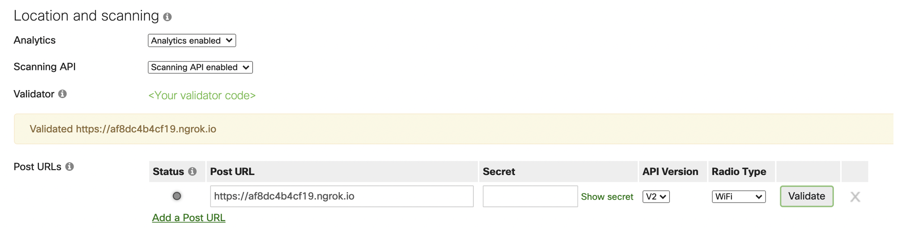

# Cisco Studio - Ciscolan kauppa

Puheen lopussa Ella ja Minna käyvät Ciscolan kaupassa, joka tarjoaa monsterin metsästyspelin kaupassa vieraileville! Tämä peli mahdollistaa alennuskuponkien keräämisen kaupassa, ja antaa viihdettä lapselle samalla kuin vanhemmat voivat keskittyä ostosten tekoon. Kyseinen peli hyödynsi lokaatioanalytiikkaa, jota pystymme saamaan Merakin tukiasemista.

---

## Mistä elementeistä Ciscolan kaupan fiktiivinen monsteripeli koostuu?


Päätelaitteen sijainnista saadaan lokaatiotietoa Meraki tukiaseman kautta. Tähän tietoon pääsemme käsiksi Merakin pilven kautta: voimme luoda webhookin ja tilata ajankohtaisen lokaatiotiedon lähetettäväksi sovelluksellemme.

## Miten Merakin lokaatiotieto saadaan omaan sovellukseen?

Merakin lokaatiotieto voidaan tilata helposti omalta Meraki dashboardiltasi (Network-Wide -> Configure -> General -> scrollaa kohtaan "Location and scanning").



Tarvitset tätä varten julkisen osoitteen, jossa vastaanotat pilvestä lähetettyä tietoa. Testailumuodossa voit käyttää esimerkiksi [ngrok-työkalua](https://ngrok.com/), joka muodostaa tunnelin ja ohjaa liikenteen määrittelemääsi localhost porttiin.

[Esimerkkikoodina ohessa](./lokaatio_webhook.py) on pythonilla toteutettu hyvin yksinkertainen flask frameworkia hyödyntävä koodi. Vastaanotamme tietoa valitussa localhost portissa ngrokin avustuksella, ja tulostamme saamamme tiedon. Tästä seuraava askel olisi valita, minkä osan saamastasi datasta haluat hyödyntää sovelluksessasi, ja lähteä parsimaan ja luomaan logiikkaa tuon tiedon ympärille.

Kunhan olet asentanut Flask-kirjaston Python virtuaaliympäristöösi, Flask sovellus ajetaan komentoriviltä seuraavasti:
```
export FLASK_APP=<tiedoston_nimi.py>
flask run -p <haluamasi portti>
```
Lisätietoa flaskin käytöstä saat [dokumentaatiosta](https://flask.palletsprojects.com/).

Haluatko oppia tarkemmin itse lokaatioanalytiikan käytöstä? Luo itsellesi ilmainen [DevNet-tunnus](https://developer.cisco.com), jonka jälkeen pääset käyttämään DevNetin ilmaisia opiskelumateriaaleja. Meraki lokaatioanalytiikalle löytyy oma [learning lab](https://learninglabs.cisco.com/lab/meraki-03-location-scanning-python/step/1)!

## Mitä muuta voin koodataa Merakin kanssa?

Aivan oikein, lokaatioanalytiikka ei ole ainoa asia mitä voit hyödyntää Merakin avoimien rajapintojen kautta. Meraki tarjoaa laajan skaalan erilaisia rajapintoja, ja paras paikka oppia lisää näistä onkin **[meraki.io](https://meraki.io)**!

Lokaatiotiedon lisäksi voit esimerkiksi tilata webhookilla alert-tietoja järjestelmästä. Kurkkaa tähän ohjeet [dokumentaatiosta](https://developer.cisco.com/meraki/webhooks/#!introduction/overview)

Voimme myös tehdä laajasti erilaisia rajapintakutsuja, kuten kysellä verkkolaitteiden tilaa tai konfiguroida langatonta verkkoa. Yleisesti, jotta voit käyttää näitä Merakin rajapintoja, tarvitsee sinun
1. Enabloida rajapinnat Merakin dashboardilta (Organization -> Configure -> Settings -> scrollaa kohtaan "Dashboard API access")
2. Luoda itsellesi API avain, jolla tunnistaudut rajapintakutsuja tehdessäsi (tämä määritellään profiilissasi, pääset oikeaan paikkaan linkistä joka on "Dashboard API access" yhteydessä). Tallenna API avain, koska se näytetään sinulle vain kerran (voit luoda sen tilalle uuden jos unohdat sen). Käytä tätä avainta tunnistautumiseen rajapintakutsuja tehdessä.


