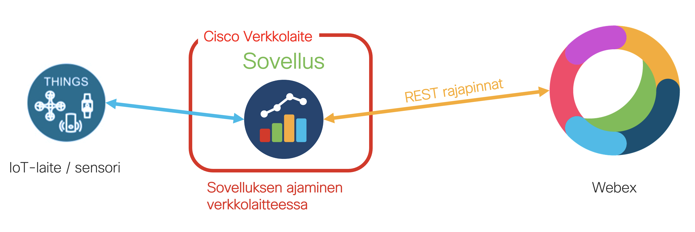
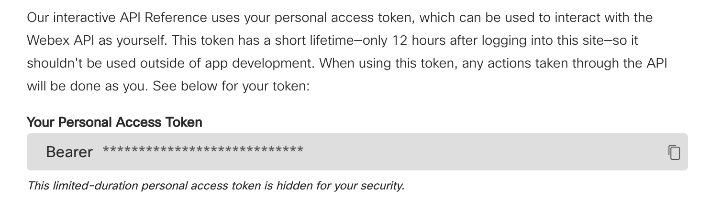
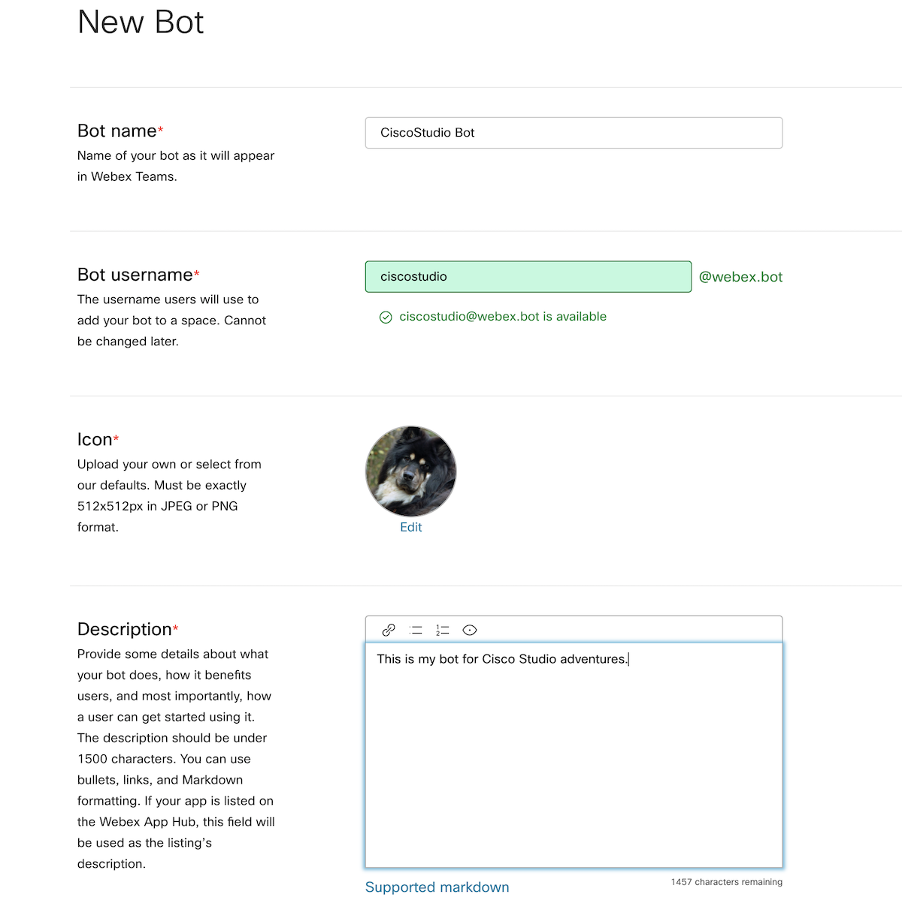
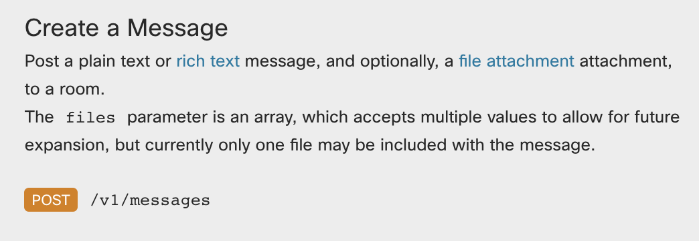
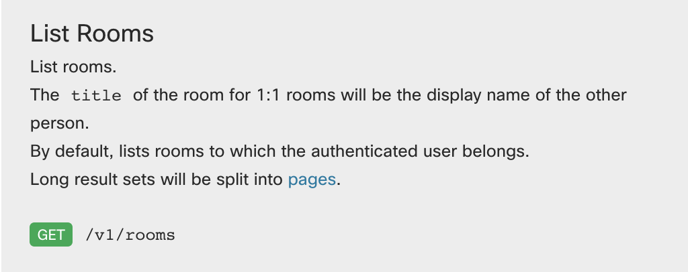
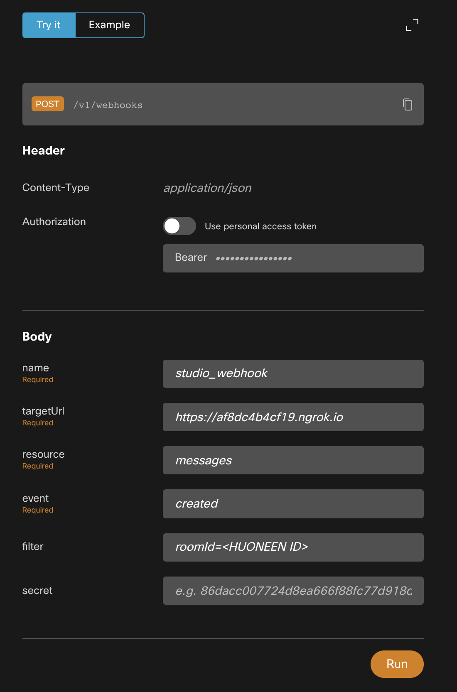

# Cisco Studio - Matin päivä

Puheessa oli mukana myös Matti, joka ajoi start uppinsa sovellusta Ciscon reitittimessä. Tämän lisäksi sovellus käytti Webexin käyttöliittymää jolloin käyttäjä voi yksinkertaisesti Webexin chatin kautta pyytää tietoja sovellukselta.

---

## Mistä elementeistä Cool Analytics ja Arkkupakastin Oy Ab:n ratkaisu koostuu?

ÄlyPakastin, joka on fiktiivinen esimerkki ja tarkoittaa käytännössä tässä käyttötapauksessa jotain IoT-laitetta tai sensoria, joka lähettää dataa toiminnastaan. Tätä varten tarvitsemme sovelluksen analysoimaan ja reagoimaan näihin viesteihin. Jotta sovellus voidaan asentaa lähelle itse tiedonlähdettä, on helppoa ja mukavaa huomata että moni Ciscon reititin ja kytkin tukee sovelluksen ajamista itse verkkolaitteessa, jolloin emme tarvitse erillistä tallennustilaa sovelluksellemme.

Toinen osa mikä oli olennainen esimerkissämme on kommunikointi Webexin kanssa. Voimme hyödyntää Webexin rajapintoja, ja näin esimerkiksi mahdollistaa käyttäjälle pyyntöjen kirjoittaminen webexin chattiin. Toisaalta, samalla voimme myös vastaanottaa varoituksia järjestelmältä suoraan Webexiin.

## Mistä saan lisää tietoa sovelluksen ajamisesta verkkolaitteessa?

Sovelluksen ajamiseen tarjolla olevat resurssit riippuvat verkkolaitteesta. Esimerkiksi Catalyst 9000 kytkimessä ajettavaa sovellusta voidaan monitoroida ja hallita keskitetysti DNA Centerin kautta, mutta myös komentoriviltä mikäli ei haluta käyttää kontrolleria. Alla linkkejä eri järjestelmien dokumentaatioon tähän liittyen:
- [Catalyst 9000 -kytkimet](https://developer.cisco.com/docs/app-hosting/#!application-hosting-in-the-enterprise/what-is-application-hosting) (huomaa että sovellusten tallennus ei ole tuettua Catalyst 9200(L) malleissa)
- [Ciscon industrial verkkolaitteet](https://developer.cisco.com/docs/iox/#!introduction-to-iox)
- [ISR 4000 ja ASR 1000 -reitittimet](https://developer.cisco.com/docs/iox/#!isr-4000asr-1000-series-platform-information/isr-4k-and-asr-1k-platforms)

## Miten Webexin rajapinnat toimivat?

Webex tarjoaa runsaasti ohjelmoitavuusominaisuuksia: Voimme hyödyntää REST rajapintoja, luoda botteja, tilata webhookin kautta ilmoituksia (sama idea kuin mitä Ciscolan kauppa käyttää Merakin ja lokaatioanalytiikan kanssa!) ja integroida Webex suoraan nettisivulle tai sovellukseen (kuten on tehnyt Ellan koulu, Ciscolan alakoulu!).

Ensisijainen paikka, mistä löytyy kaikki Webexin ohjelmoitavuuteen liittyvä dokumentaatio, on [developer.webex.com](https://developer.webex.com). Voit kirjautua tänne Webex tunnuksillasi, ja myös kokeilla rajapintojen toimintaa dokumentaatiossa.

Meidän esimerkissämme on seuraavat palaset Webexistä:
1. Haluamme ensinnäkin pystyä kirjottamaan viestin Webex chattiin, johon sovelluksemme voi sitten reagoida (esimerkiksi voimme pyytää tietoa pakastimen tämän hetkisestä täyttöasteesta). Tätä varten meillä tarvitsee olla käytössä webhook, jolla kuuntelemme viestejä ja reagoimme niihin oikealla tavalla.
2. Haluamme myös pystyä vastaanottamaan viestejä chatissa: joko vastauksena lähettämäämme kysymykseen, tai yleisenä hälytyksenä kun tietty raja-arvo ylittyy ÄlyPakastimessa. Tähän käytämme Webexin REST rajapintoja, jotka mahdollistavat viestien lähettämisen.
3. Näihin kahteen tarpeeseen emme halua sitoa ketään oikeaa ihmistä: tietoturvasyistä on tärkeää ettei sovelluksessa liiku tunnuksia jolla joku voisi päästä toisen henkilön viesteihin kiinni. Toisaalta, haluamme olla skaalautuvia ja ketteriä ja näin pitää sovelluksen irti yksittäisestä henkilöstä. Siksi käytämmekin näihiin toimintoihin bottia.

## Token: henkilökohtainen vai Bot? Miten Bot luodaan?

Käytännössä Webex rajapintojen käyttöön tarvitsemme tokenin, joka oikeuttaa meitä tekemään meille sallittuja asioita. Kun käytämme Botin tokenia tässä, pystymme rajaamaan hyvinkin pienelle alueelle kyseisen tokenin oikeudet, ja näin ylläpitämään hyvää tietoturvaa ratkaisussamme. Voit kuitenkin testailumielessä käyttää myös väliaikaista omaa tokeniasi, minkä löydätkin [developer.webex.com](https://developer.webex.com) -> Documentation -> REST API -> Getting Started.

Botin luominen on yksinkertaista. Löydät oikean paikan kun menet [developer.webex.com](https://developer.webex.com) -> Documentation -> Bots -> Create a Bot. Täytä haluamasi tiedot ja valitse "Add Bot". Huolehdi että otat Botin tokenin talteen, se näytetään sinulle vain kerran. Voit kuitenkin myös generoida uuden tokenin myöhemmin, mikäli unohdat tai hukkaat vanhan tokenin.

Jotta voit käyttää Botia viestien lähettämiseen ja lukemiseen, tarvitsee botin olla osallisena siinä huoneessa tai keskustelussa jota se kuuntelee. Muista siis lisätä uusi Bottisi siihen huoneeseen jossa haluat toimia sen kanssa, tai aloittaa 1:1 keskustelu sen kanssa. Bot näkee vain ne viestit jotka ovat suunnattu sille.

**[Lue lisää Botin toiminnasta täältä](https://developer.webex.com/docs/bots)**

## Viestin lähettäminen Webex chattiin rajapinnan kautta

[Esimerkkikoodissamme](./send_webex_message.py) käymme yksinkertaisen esimerkin, jossa voimme lähettää viestin Webexiin jostain toisesta sovelluksesta. Jos kurkkasit Webexin REST rajapinta -dokumentaatiota, huomasit varmaan että siellä on iso määrä erilaisia rajapintakutsuja joita voimme toteuttaa. Viestin lähettämiseksi haluamme käyttää *post message* rajapintaa. Näetkin esimerkkikoodissa, kuinka tämä voidaan tehdä yksinkertaisesti.

Koodissa on kaksi kohtaa jotka vaativat huomiotasi: Token ja huoneen ID.
1. Voit koodia ajaessa käyttää joko henkilökohtaista lyhytkestoista tokeniasi tai Botin tokenia, mutta huomaa että Botin tarvitsee olla lisättynä siihen huoneeseen johon haluat lähettää koodin viestin.
2. Huoneen ID määrittää mihin viesti lähetetään. Voit hakea Webex huoneiden ID:t myös rajapintakutsun avulla: kokeile tähän dokumentaation *get rooms* rajapintaa!

## Miten voimme kuunnella ryhmässä lähetettyjä viestejä ja reagoida niihin sovelluksessamme?

Jotta voimme reagoida sovelluksessamme viesteihin joita Webex tsätissä lähetetään, tarvitsee meidän saada jollain tapaa ilmoitus kun ryhmään on ilmestynyt viesti. Voimme tehdä tämän webhookin avulla, jolloin tilaamme ilmoitukset uusista viesteistä määrittelemäämme osoitteeseen. Tämän logiikka on sama kuin Merakin kohdalla, joten kurkkaa tarkemmin Webhookin toimintaperiaatteista Ciscolan kaupan osuudesta.

Webexissä webhookit luodaan rajapintakutsulla. Huomaa että jos käytät Bottia, sinun tarvitsee käyttää Botin tokenia webhookia luodessa.

