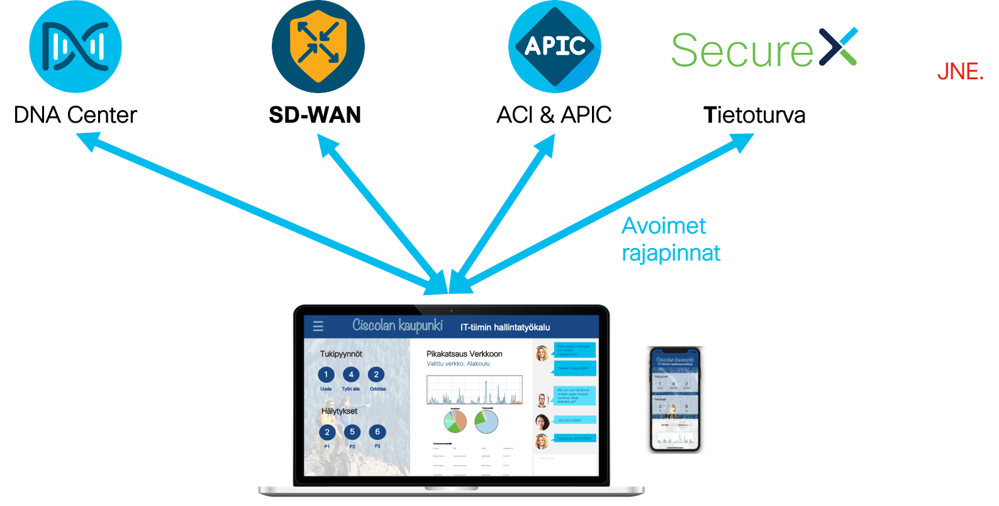
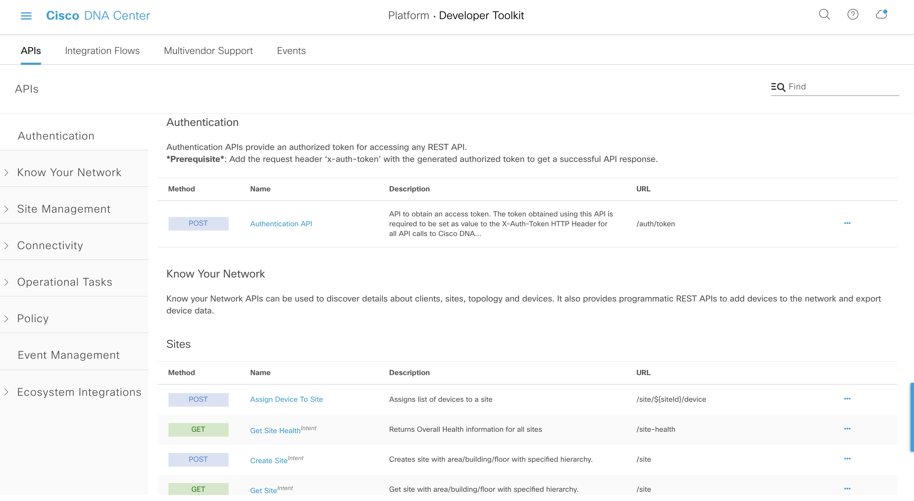

# Cisco Studio - Minnan päivä

Puheessa kuulimme kuinka Minna, Ciscolan kaupungin IT johtaja, hyödyntää erilaisten järjestelmien rajapintoja kustomoidun sovelluksen muodossa. Näin Minnan tiimi pystyy korreloimaan tietoa eri järjestelmistä, saamaan hälytyksiä ja tekemään muutoksia, kaikki tämä ilman tarvetta hyppiä dashboardista toiseen.

---

## Mistä elementeistä Ciscolan kaupungin fiktiivinen hallintakäyttöliittymä koostuu?

Hyödyntäen avoimia rajapintoja, tuomme tietoa yhteen käyttöliittymään kaikista muista käytössä olevista järjestelmistä. Näin voimme korreloida nuo muiden järjestelmien tiedot keskenään, tuoda juuri oikean ja relevantin tiedon käyttäjän nähtäville, sekä automatisoida "end-to-end" juuri sinun organisaatiosi tarpeiden mukaisesti. Huomaa, että vaikka kuvassa on vain Cisco ratkaisuja, ohjelmoitavuus mahdollistaa myös muiden ratkaisujen yhdistämisen tähän samaan sovellukseen, kunhan näillä ratkaisuilla myös on tarjolla avoimia rajapintoja.

## Mistä löydän dokumentaatiota eri Cisco-järjestelmien rajapinnoista?

[DevNet](https://developer.cisco.com) tarjoaa kattavasti dokumentaatiota kaikkien Cisco ratkaisujen ohjelmoitavuudesta. Tässä kuitenkin tarkemmat linkit tässä esimerkissä mainittujen Cisco ratkaisujen rajapintojen dokumentaatioon:
- [Cisco DNA Center](https://developer.cisco.com/docs/dna-center/#!cisco-dna-center-platform-overview)
- [Cisco SD-WAN](https://developer.cisco.com/docs/sdwan/#!introduction/cisco-sd-wan-vmanage-api)
- [Cisco APIC & ACI](https://developer.cisco.com/docs/aci/#!introduction)
- [Cisco SecureX](https://developer.cisco.com/site/security/)

## Esimerkki kuinka DNA Centerin rajapintojen kanssa voidaan kommunikoida

[Tässä esimerkki koodi](./dnacenter_apis.py) yhdestä listassa olevasta ratkaisusta, DNA Centeristä. Kyseisessa yksinkertaisessa Python koodissa haemme authentication tokenin, jonka jälkeen pystymme hakemaan tiedon verkon kaikista laitteista. Lopuksi tulostamme kustakin laitteesta mallin ja hostnamen. Huomaa että vaikka esimerkkikoodimme on kirjoitettu Pythonilla, eivät rajapinnat ole riippuvaisia käytettävästä kielestä, vaan tätä voidaan soveltaa myös muihin kieliin.

DNA Center on kontrolleri lähiverkkojen hallintaan, automatisointiin ja näkyvyyden tuomiseen analytiikan avulla.
DNA Center tarjoaa kattavan määrän REST rajapintoja, ja uusissa softaversioissa rajapintojen määrää täydennetään. Dokumentaatiota voidaan lukea joko [DevNetin sivuilta](https://developer.cisco.com/docs/dna-center/#!cisco-dna-center-platform-overview) tai suoraan omasta DNA Centerin käyttöliittymästä (Platform -> Developer Toolkit -> APIs).

DNA Center vaatii rajapintojen käytössä authentication tokenin. Tämän hakemiseksi DNA Centeristä on oma rajapintakutsunsa, joka vaatii Base64 encodatun DNA Center käyttäjänimen ja salasanan. Näetkin tämän ensimmäisenä kohtana esimerkkikoodissa. Sen jälkeen voimme hyödyntää saamaamme tokenia muiden rajapintakutsujen mukana.

## Missä voin oppia lisää?

DevNet tarjoaa learning labseja, joiden kautta voit oppia lisää aiheesta. Luo itsellesi ilmainen [DevNet-tunnus](https://developer.cisco.com), jonka jälkeen pääset käyttämään näitä DevNetin ilmaisia opiskelumateriaaleja. Kurkkaa esimerkiksi opetusmateriaali [DNA Centerin ohjelmotavuudesta](https://developer.cisco.com/learning/modules/dnac-rest-apis).

Huomaa myös että DevNetillä on tarjolla paljon ilmaisia [Sandboxeja](https://devnetsandbox.cisco.com/), joilla voit testailla koodiasi!
