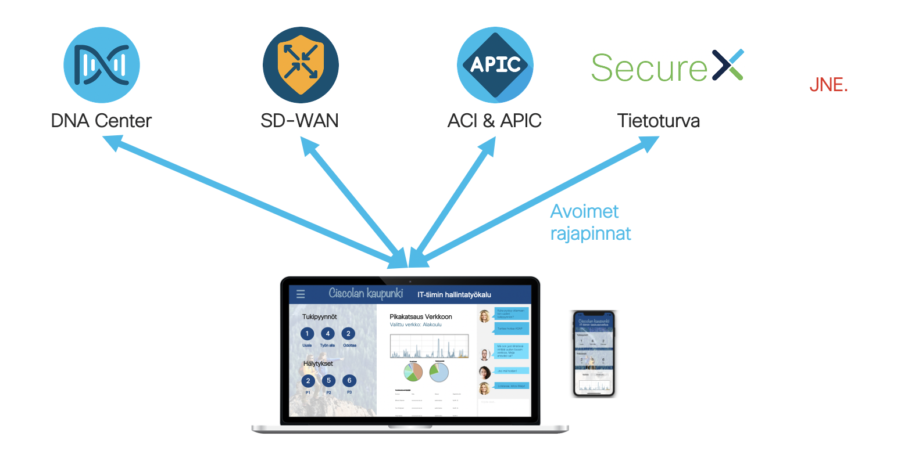

# Cisco Studio - Minnan päivä

Puheessa kuulimme kuinka Minna, Ciscolan kaupungin IT johtaja, hyödyntää erilaisten järjestelmien rajapintoja kustomoidun sovelluksen muodossa. Näin Minnan tiimi pystyy korreloimaan tietoa eri järjestelmistä, saamaan hälytyksiä ja tekemään muutoksia, kaikki tämä ilman tarvetta hyppiä dashboardista toiseen.

---

## Mistä elementeistä Ciscolan kaupungin fiktiivinen hallintakäyttöliittymä koostuu?

Hyödyntäen avoimia rajapintoja, tuomme tietoa yhteen käyttöliittymään kaikista muista käytössä olevista järjestelmistä. Näin voimme korreloida nuo muiden järjestelmien tiedot keskenään, tuoda juuri oikean ja relevantin tiedon käyttäjän nähtäville, sekä automatisoida "end-to-end" juuri sinun organisaatiosi tarpeiden mukaisesti. Huomaa, että vaikka kuvassa on vain Cisco ratkaisuja, ohjelmoitavuus mahdollistaa myös muiden ratkaisujen yhdistämisen tähän samaan sovellukseen, kunhan näillä ratkaisuilla myös on tarjolla avoimia rajapintoja.

## Mistä löydän dokumentaatiota eri Cisco-järjestelmien rajapinnoista?

[DevNet](https://developer.cisco.com) tarjoaa kattavasti dokumentaatiota kaikkien Cisco ratkaisujen ohjelmoitavuudesta. Tässä kuitenkin tarkemmat linkit tässä esimerkissä mainittujen Cisco ratkaisujen rajapintojen dokumentaatioon:
- [Cisco DNA Center](https://developer.cisco.com/docs/dna-center/#!cisco-dna-center-platform-overview)
- [Cisco SD-WAN](https://developer.cisco.com/docs/sdwan/#!introduction/cisco-sd-wan-vmanage-api)
- [Cisco APIC](https://developer.cisco.com/docs/aci/#!introduction)
- [Cisco SecureX](https://developer.cisco.com/site/security/)

## Esimerkki kuinkaa DNA Centerin rajapintojen kanssa voidaan kommunikoida

Tässä esimerkki yhdestä listassa olevasta ratkaisusta, DNA Centeristä. Huomaa että vaikka esimerkkikoodi on kirjoitettu Pythonilla, eivät rajapinnat ole riippuvaisia käytettävästä kielestä, vaan tätä voidaan soveltaa myös muihin kieliin.

DNA Center vaatii rajapintojen käytössä authentication tokenin. Tämän hakemiseksi DNA Centeristä on oma rajapintakutsunsa, joka vaatii Base64 encodatun DNA Center käyttäjänimen ja salasanan. Näetkin tämän ensimmäisenä kohtana esimerkkikoodissa. Sen jälkeen voimme hyödyntää saamaamme tokenia muiden rajapintakutsujen mukana.

